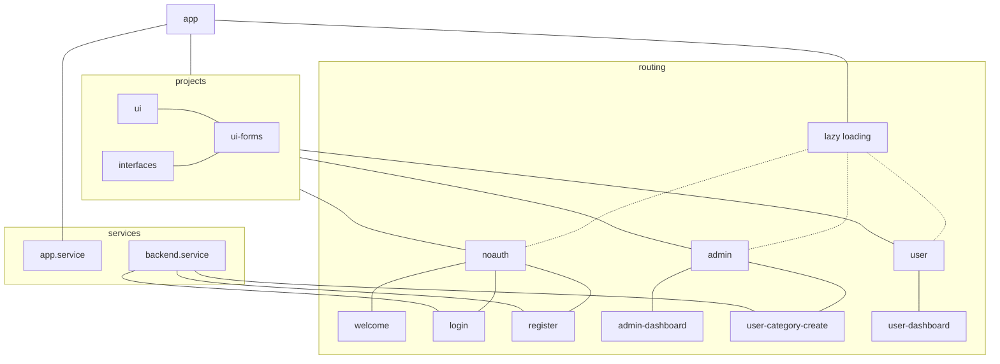

# Coding Factory 2022

## Ανάπτυξη fullstack web εφαρμογής

### Development branch

Στο development branch γίνονται merge οι ουσιαστικές αλλαγές κατά την ανάπτυξη της εφαρμογής

### Changelog

#### lazy-loading branch

#### libraries-more branch

Ανάπτυξη βιβλιοθήκης φορμών και τύπων δεδομένων της εφαρμογής

#### library-primer branch

Ανάπτυξη βιβλιοθήκης Angular με τα βασικά UI components που θα χρησιμοποιεί η εφαρμογή στο frontend.

#### tailwindcss branch

Μετά την εγκατάσταση στο frontend του [tailwindcss](https://tailwindcss.com/) έχουμε την παρακάτω εμφάνιση της εφαρμογής:

