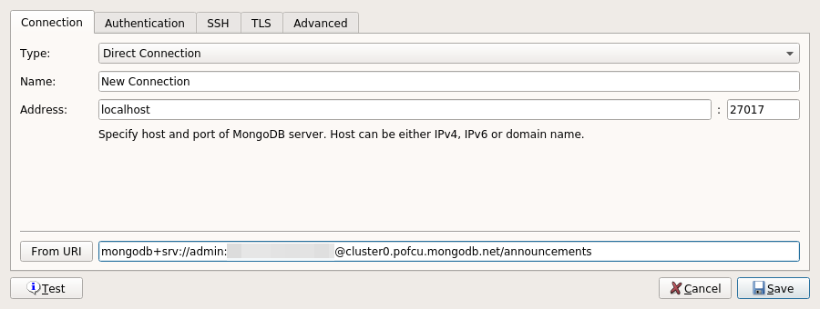
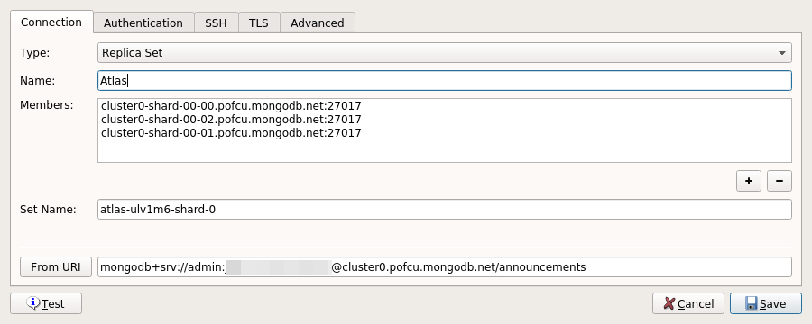

# Coding Factory 2022

## Ανάπτυξη fullstack web εφαρμογής

- Python Flask backend με χρήση του MongoEngine και της υπηρεσίας Atlas (MongoDB as a Service)
- Angular frontend

Αναζητήστε στα διάφορα branches όλα αυτά που αναπτύσσουμε κατά τη διάρκεια των διαλέξεων. Μετά την κλωνοποίηση του main repository:

```
$ git clone https://github.com/christodoulos/coding-factory-fullstack.git
```

μπορείτε να κάνετε checkout τα διάφορα branches έτσι ώστε να αλλάζει ο κώδικας τοπικά στη μορφή που είχε κατά τη διάρκεια της διάλεξης. Π.χ., για checkout του branch `components-input-output` δώστε (μέσα στον κατάλογο `coding-factory-fullstack`):

```
$ git checkout -b components-input-ouput origin/components-input-ouput
```

Branches που συμβάλλουν στην τελική εφαρμογή θα γίνονται merge πίσω στο branch [develop](https://github.com/christodoulos/coding-factory-fullstack/tree/develop).

Μέχρι στιγμής υπάρχουν τα παρακάτω branches:

- 1η Εβδομάδα: [Angular Components, Input και Output](https://github.com/christodoulos/coding-factory-fullstack/tree/components-input-ouput/frontend/src/app)
- 2η Εβδομάδα:
  - [Angular routing](https://github.com/christodoulos/coding-factory-fullstack/tree/routing/frontend/src/app)
  - [Angular με tailwindcss](https://github.com/christodoulos/coding-factory-fullstack/tree/tailwindcss) (merged in develop)
  - Angular libraries
    - [UI library](https://github.com/christodoulos/coding-factory-fullstack/tree/library-primer/frontend/projects/ui/src/lib): Βιβλιοθήκη με βασικά παραμετροποιημένα components εμφάνισης, όπως κουμπιά, μενού, πεδία φόρμας κτλ
    - [UI library demo](https://github.com/christodoulos/coding-factory-fullstack/tree/library-primer/frontend/src/app)

### Ρυθμίσεις της υπηρεσίας Atlas

- Θυμηθείτε ή αλλάξτε το password του χρήστη διαχειριστή της υπηρεσίας Atlas (χρησιμοποιήστε τα στοιχεία παρακάτω στο αρχείο `.env`):

  

- Για τη διευκόλυνσή σας κατά τη διάρκεια της ανάπτυξης επιτρέψτε τις δικτυακές συνδέσεις από παντού:

  

- Σημειώστε το connection string και χρησιμοποιήστε το παρακάτω στο αρχείο `.env`.

  

#### Χρήση του Robo3T (προαιρετικά)

Στα πλαίσια των μαθημάτων χρειαζόμαστε ένα απλό τρόπο αλληλεπίδρασης με τη βάση. Αυτό μπορεί να γίνει είτε με τη σελίδα του Atlas, είτε με το Studio3T είτε με το Robo3T που μπορείτε να κατεβάσετε στον υπολογιστή σας από [εδώ](https://github.com/Studio3T/robomongo).

Αναζητήστε το connection string του Compass από τη σελίδα του Atlas και εισάγετε στο πεδίο `From URI`:



Στη συνέχεια πατήστε το κουμπί `From URI`, δώστε ένα όνομα στη σύνδεση και πατήστε Save:



Ενδέχεται να χρειαστεί και η παρακάτω ρύθμιση:


### Εγκατάσταση τοπικά της fullstack εφαρμογής

Επιλέξτε ένα κατάλογο και μετακινηθείτε μέσα σε αυτόν. Στη συνέχεια:

```
$ git clone https://github.com/christodoulos/coding-factory-fullstack.git
```

Δημιουργείται κατάλογος `coding-factory-fullstack` με υποκαταλόγους `frontend` (εφαρμογή Angular) και `backend` (εφαρμογή Flask).

### Python Virtual Environment στο backend

```
$ cd backend
$ python -m venv venv
$ venv\Scripts\activate (ή source venv\Scripts\activate στο Git Bash)
$ pip install -r requirements.txt
```

Στον ίδιο κατάλογο `backend` δημιουργήστε το αρχείο `.env`:

```
SECRET_KEY="a long, compicated, and hard to guess string"
MONGODB_SETTINGS_USERNAME="<your atlas admin username>"
MONGODB_SETTINGS_PASSWORD="<your atlas admin password>"
MONGODB_SETTINGS_HOST="mongodb+srv://<your atlas cluster url>/<db name>?retryWrites=true&w=majority"
```

Στη συνέχεια στον κατάλογο `backend`:

```
$ flask --debug run
Demo root user already in database!
 * Debug mode: on
WARNING: This is a development server. Do not use it in a production deployment. Use a production WSGI server instead.
 * Running on http://127.0.0.1:5000
Press CTRL+C to quit
 * Restarting with stat
 * Debugger is active!
 * Debugger PIN: 739-267-897
```

Ελέγξτε τη λειτουργία του backend:


### Εγκατάσταση πακέτων για το frontend

Στον κατάλογο `coding-factory-fullstack`:

```
$ cd frontend
$ npm install
$ ng serve
- Generating browser application bundles (phase: setup)...
√ Browser application bundle generation complete.

Initial Chunk Files   | Names         |  Raw Size
vendor.js             | vendor        |   1.78 MB |
polyfills.js          | polyfills     | 319.82 kB |
styles.css, styles.js | styles        | 211.85 kB |
main.js               | main          |  48.04 kB |
runtime.js            | runtime       |   6.51 kB |

| Initial Total |   2.35 MB

Build at: 2022-09-04T05:51:47.282Z - Hash: 39bac4c8571c7f1e - Time: 5953ms

** Angular Live Development Server is listening on localhost:4200, open your browser on http://localhost:4200/ **


√ Compiled successfully.
```

Ελέγξτε τη λειτουργία του frontend:


